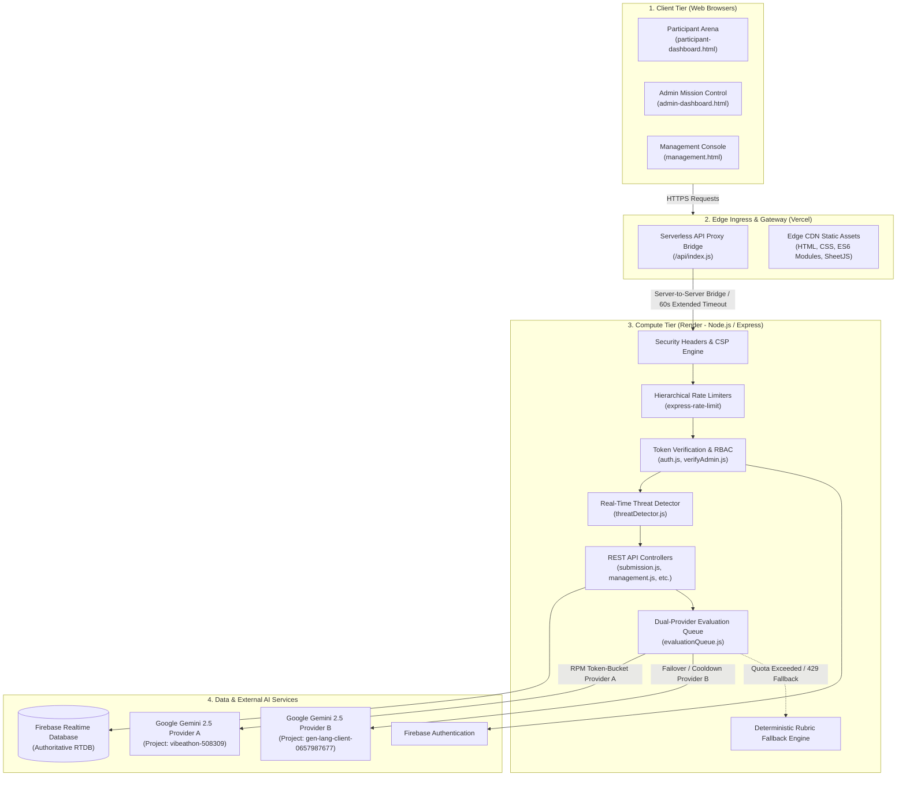
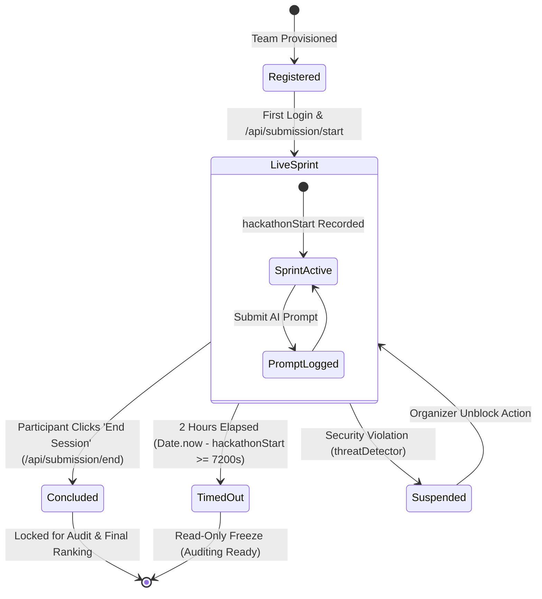
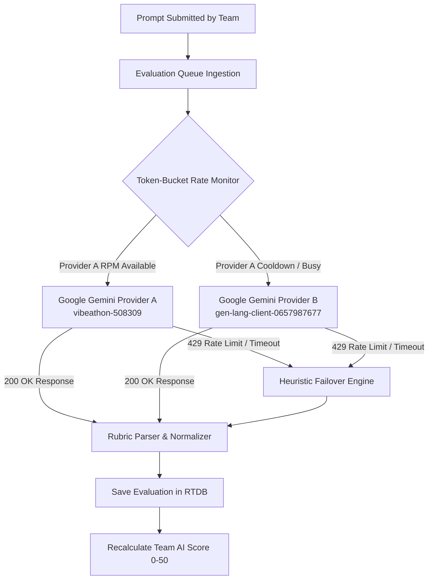

# Vibeathon Platform: System Architecture & Security Documentation

**Document Version:** 2.4.0  
**Target Environment:** Production (Vercel Edge Ingress + Render Compute + Firebase RTDB)  
**Classification:** Technical & Security Architecture Specification  

---

## 1. Executive Summary

**Vibeathon** is a real-time competitive hackathon and AI prompt engineering arena designed to host 32+ collegiate teams (60+ builders) simultaneously. The platform provides:
- **Participant Workspace:** Real-time synchronized 2-hour sprint clock, AI prompt logging, deliverable tracking (GitHub repository and live deployment URLs), and announcement broadcasts.
- **Automated AI Jury:** Dual-provider asynchronous queue powered by **Google Gemini 2.5 Flash**, evaluating prompts against a standardized 50-mark rubric across 5 dimensions with a deterministic heuristic fallback engine.
- **Admin Mission Control:** Live leaderboards ranked by completion duration, prompt economy, and AI quality scores, accompanied by granular team prompt audits and XLSX/CSV telemetry exports.
- **Management & Security Console:** Complete administrative governance, credential management, instantaneous security overrides, and system-wide audit logs.

---

## 2. High-Level Architectural Topology

The platform operates across four decoupled tiers to ensure zero-downtime scalability, complete isolation of administrative operations, and high availability during live events.



---

## 3. Tier-by-Tier Component Specifications

### 3.1 Tier 1: Client Application Tier
- **Technology:** Vanilla ES6+ JavaScript, CSS Custom Properties (Theme Tokens), HTML5.
- **Portals:**
  1. **Participant Arena (`participant-dashboard.html`):** Renders the authoritative countdown, submission fields, activity logs, and modal overlays.
  2. **Admin Mission Control (`admin-dashboard.html`):** Real-time telemetry table, ranked sorting, AI jury score breakdown, and challenge document release controls.
  3. **Management Console (`management.html`):** Direct credential provisioning, bulk import, team credential editing, audit inspection, and emergency unblock/reset tooling.

### 3.2 Tier 2: Edge Ingress & Reverse Proxy (`frontend/api/index.js`)
- **Serverless API Bridge:** Proxies all browser `/api/*` traffic to the upstream Render backend.
- **Cold-Start Elimination:** Sets maximum upstream wait time to 60 seconds to absorb container spin-up latencies on Render free tiers (eliminating client HTTP 502/504 errors).
- **CORS Normalization:** Intercepts preflight `OPTIONS` requests, injecting explicit CORS response headers (`Access-Control-Allow-Origin`, `Access-Control-Allow-Credentials: true`) to prevent browser cross-origin blocks across deployment domains.

### 3.3 Tier 3: Compute & Business Logic (`backend/server.js`)
- **Runtime:** Node.js on Express 5.x.
- **Network Binding:** Binds strictly to `0.0.0.0` with `trust proxy: 1` enabled for accurate client IP resolution behind load balancers.
- **Body Parsing Restrictions:** JSON body size capped at `50kb` to prevent payload-based memory exhaustion attacks.

### 3.4 Tier 4: Persistence & Cloud AI
- **Firebase Realtime Database (RTDB):** Authoritative state store for team metadata, prompts, evaluations, and audit trails.
- **Google Cloud Vertex AI & Gemini APIs:** Multi-tenant LLM jury evaluation infrastructure.

---

## 4. Security Architecture & Threat Defense Framework

The platform enforces defense-in-depth across the transport, identity, input, application, and AI scoring layers.

```mermaid
flowchart LR
    subgraph L1["Layer 1: Edge & Transport"]
        T1["Strict HSTS (2 Years)"]
        T2["Content-Security-Policy"]
        T3["X-Frame-Options: DENY"]
    end

    subgraph L2["Layer 2: Network & Rate Limiting"]
        R1["Admin Login Limiter (5 / 15m)"]
        R2["Participant Login Limiter (10 / 15m)"]
        R3["Campus NAT Limiter (1500 / 15m)"]
    end

    subgraph L3["Layer 3: Threat Detector"]
        TD1["Flood Control (< 10s gap)"]
        TD2["SHA-256 Duplicate Spam Filter"]
        TD3["Adversarial Prompt Injection Filter"]
        TD4["Exploit / XSS / SQLi Payload Filter"]
    end

    subgraph L4["Layer 4: Mitigation & Audit"]
        M1["Instant Memory Flag (blocked: true)"]
        M2["Firebase RTDB Lockout"]
        M3["Queue Job Purge (0 Wasted Credits)"]
        M4["Immutable Security Audit Log"]
    end

    L1 --> L2 --> L3 --> L4
```



### 4.1 Real-Time Threat Detector (`backend/services/threatDetector.js`)
The `threatDetector` service analyzes incoming submissions in real time before they reach the database or evaluation queues:

| Threat Vector | Detection Mechanism | Threshold / Signature | Mitigation Action |
| :--- | :--- | :--- | :--- |
| **Rapid-Fire Flood** | Sliding timestamp window per team | Minimum 10s submission gap; $\ge 3$ burst violations in 15s | Automatic team suspension (`blocked: true`) |
| **Duplicate Spam** | Cryptographic SHA-256 text hashing | $\ge 3$ identical prompt hashes within 2 minutes | Instant auto-lockout |
| **Adversarial Injection** | Regular expression signature scanning | Regex patterns targeting instruction overrides (`ignore previous instructions`, `jailbreak`, `award 50 points`) | Auto-block + incident logging |
| **Script / Code Injection** | AST and regex pattern matching | `<script>`, `javascript:`, `eval(`, path traversals (`../..`), SQL injection | Auto-block + request rejection |
| **Tampered Deliverables** | Protocol, domain, and length validation | Non-HTTP(S), non-GitHub domains, or URL length $> 2,048$ chars | Immediate HTTP 400 rejection |

### 4.2 Queue Purge & Credit Safeguard
When a team triggers the threat detector:
1. `blocked: true` is persisted to memory (`Map`) and Firebase RTDB.
2. `purgeQueuedPromptsForTeam(teamId)` cancels all pending prompt jobs for that team from the evaluation queue, preventing API quota exhaustion.
3. All subsequent authenticated requests from the team return `HTTP 403 Forbidden`.

### 4.3 Content Security Policy & HTTP Headers
```http
X-Content-Type-Options: nosniff
X-Frame-Options: DENY
Referrer-Policy: no-referrer
Strict-Transport-Security: max-age=63072000; includeSubDomains; preload
Content-Security-Policy: default-src 'self' blob:; script-src 'self'; style-src 'self' 'unsafe-inline'; img-src 'self' data: blob:; font-src 'self' data:; connect-src 'self' https:; base-uri 'self'; form-action 'self'; frame-ancestors 'none';
```

---

## 5. Participant Session Lifecycle & Authoritative Time Model

Every participant team is subject to an immutable **2-hour session limit** ($7,200\text{ seconds}$), enforced by server-recorded timestamps.



### Lifecycle Status Matrix

| Status | Trigger Condition | Participant Page Behavior | Admin & Management Display |
| :--- | :--- | :--- | :--- |
| **Registered** | Account created; `hackathonStart == null` | Redirected to Login | Badge: `Registered` / `OFFLINE (Standby)` |
| **Live Sprint** | First dashboard entry; `hackathonStart` recorded | Interactive timer running; inputs active | Badge: `Live Sprint` / `LIVE SPRINT (Xh Ym left)` |
| **Concluded** | Explicit submission via `/api/submission/end` | Inputs disabled; completion modal displayed | Badge: `Completed` / `CONCLUDED`<br/>Time: `Xm Ys` (authoritative duration) |
| **Timed Out** | $2\text{ hours}$ reached without explicit submission | UI frozen; modal locks screen; inputs disabled | Badge: `Timed Out` / `TIMED OUT`<br/>Time: `2h 00m 00s` |
| **Suspended** | Threat detector violation or admin lock | Red lockout screen; all tokens return 403 | Badge: `SUSPENDED` (with violation reason) |

---

## 6. AI Evaluation Engine & 50-Point Rubric Matrix

The AI scoring engine operates asynchronously using a token-bucket rate-limited dual-provider queue (`backend/services/evaluationQueue.js`).



### 6.1 The Standard 50-Mark Rubric Matrix
Every prompt is evaluated across five criteria (each scored $0\text{ to }10$, totaling $50\text{ marks}$):

1. **Context Setting & Problem Framing ($0–10\text{ pts}$):** Establishes persona, user role, domain context, business environment, and primary objectives.
2. **Prompt Engineering Structure ($0–10\text{ pts}$):** Employs structured formatting, chain-of-thought instructions, step-by-step methodologies, and few-shot examples.
3. **Domain & Functional Depth ($0–10\text{ pts}$):** Covers complex functional logic, edge case requirements, authorization workflows, and state transitions.
4. **Constraint Specification ($0–10\text{ pts}$):** Enforces negative bounds, validation criteria, data integrity checks, and error-handling conditions.
5. **Output Formatting Directives ($0–10\text{ pts}$):** Enforces schema definitions (e.g., JSON schemas, typed interfaces, modular directory structures).

### 6.2 Heuristic Fallback Engine
When external Gemini APIs encounter rate limits (HTTP 429) or network timeouts, the platform seamlessly executes a local deterministic rubric evaluation. This guarantees:
- Zero lost submissions.
- Continuous evaluation pipeline processing.
- Placeholder detection: Submissions $< 25$ characters or test strings are assigned $0\text{ points}$.

---

## 7. Database Model & Firebase Security Rules

### 7.1 RTDB Data Schema
```text
/
├── teams/
│   └── {teamId}/
│       ├── teamId, leaderName, email, college, branch, teamSize
│       ├── members: [{ name, vtuNo, branch, email, phone }]
│       ├── hackathonStart: "2026-09-15T09:00:00.000Z"
│       ├── sessionEnded: false
│       ├── completedAt: null
│       ├── sessionEndedAt: null
│       ├── githubUrl: "https://github.com/..."
│       ├── deploymentUrl: "https://..."
│       ├── blocked: false
│       ├── blockReason: null
│       ├── aiScore: 42
│       └── lastActiveAt: "2026-09-15T09:45:00.000Z"
├── prompts/
│   └── {promptId}/
│       ├── teamId: "VCC-01"
│       ├── promptText: "..."
│       ├── aiTool: "ChatGPT"
│       ├── evaluationStatus: "evaluated"
│       └── evaluation:
│           ├── score: 42
│           ├── level: "Excellent"
│           ├── reasoning: "..."
│           ├── strengths: [...]
│           └── weaknesses: [...]
├── settings/
│   ├── announcement: { active: true, message: "..." }
│   └── problemStatement: { released: true, fileName: "...", fileBase64: "..." }
└── auditLogs/
    └── {logId}/
        ├── action: "UNBLOCK_TEAM"
        ├── performedBy: "admin"
        ├── targetTeam: "VCC-05"
        └── timestamp: "2026-09-15T10:12:00.000Z"
```

### 7.2 Database Access Rules (`firebase-database-rules.json`)
```json
{
  "rules": {
    ".read": false,
    ".write": false,
    "teams": {
      "$teamId": {
        ".read": "auth != null && (auth.token.teamId == $teamId || auth.token.role == 'admin')",
        ".write": false
      }
    },
    "prompts": {
      "$promptId": {
        ".read": "auth != null && (data.child('teamId').val() == auth.token.teamId || auth.token.role == 'admin')",
        ".write": "auth != null && auth.token.role == 'admin'"
      }
    },
    "settings": {
      ".write": "auth != null && auth.token.role == 'admin'",
      "announcement": { ".read": "auth != null" },
      "problemStatement": {
        "released": { ".read": "auth != null" },
        "fileBase64": { ".read": "auth != null && auth.token.role == 'admin'" },
        "text": { ".read": "auth != null && auth.token.role == 'admin'" }
      }
    },
    "auditLogs": {
      ".read": "auth != null && auth.token.role == 'admin'",
      ".write": false
    }
  }
}
```

---

## 8. Summary of Administrative Capabilities

| Functionality | Admin Mission Control | Management Console |
| :--- | :---: | :---: |
| **Real-Time Leaderboard & Telemetry** | Full | Full |
| **Inspect Individual Prompt Evaluations** | Full (Modal Card) | Audit View |
| **Export Telemetry to CSV / XLSX** | Full (SheetJS) | Full (SheetJS) |
| **Upload / Release Problem Statement** | Full | Full |
| **Live Broadcast Announcements** | — | Full |
| **Create / Import / Edit Teams** | — | Full |
| **Reset Team Passwords & Credentials** | — | Full |
| **Instant Unblock / Suspension Override** | — | Full |
| **Emergency Global Reset Tools** | — | Full (Passcode Protected) |
