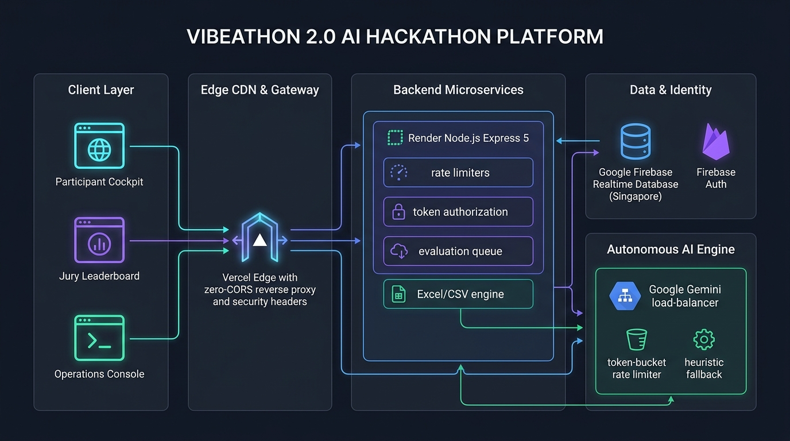

# Vibeathon 2.0 — National AI Hackathon Platform

An enterprise-grade, high-intensity competition platform engineered for university and national hackathons featuring real-time AI prompt telemetry, autonomous rubric grading, synchronized countdown timers, and full-spectrum administrative control.



---

## 🏛️ Production Architecture Overview

The platform is designed around an event-driven, decoupled monorepo topology:

```
GitHub Repository: PratikDas-VTU/Vibeathon
  ├── frontend/   ──> Deployed on Vercel (Edge CDN, SSL, Zero-CORS /api rewrite proxy)
  └── backend/    ──> Deployed on Render (Node.js/Express 5 Microservice, Port 5000 / 0.0.0.0)
```

- **Client Layer:** Pure vanilla ES6+ JavaScript, responsive Glassmorphism / Cyber HUD styling, zero frontend build overhead.
- **API Gateway & Microservices:** Node.js & Express.js 5 REST API with robust security headers, CORS guards, and tokenized custom claims.
- **Database & Identity:** **Firebase Realtime Database (RTDB)** (Singapore region for sub-50ms latency) & **Firebase Authentication**.
- **AI Evaluation Subsystem:** **Enterprise Two-Provider Gemini Architecture** (Gemini 2.5 / 3.5 Flash Lite) with per-provider token bucket rate limiting, bounded concurrency, automated failover, idempotent queue deduplication, and continuous auto-recovery.

---

## 🌟 Core System Portals

1. **Participant Sprint Arena (`participant-login.html` & `participant-dashboard.html`):**
   - Direct login with **Team ID** (e.g. `DEMO101`) or Leader Email with automatic credential sync.
   - Server-authoritative 2-hour countdown timer (immune to client clock changes and refreshes).
   - Real-time GitHub repo and Live Deployment URL validation and submissions.
   - **AI Prompt Telemetry Logger:** Verbatim prompt capture with AI model selection and strict team ownership isolation (`teamId` / `vccId` scoped; no cross-team counting contamination).
   - **Privacy Shield:** Confirmation badges show delivery (`✓ Logged`), but numerical AI scores (`0–50`) and jury reasoning remain **strictly hidden** from participants during the hackathon.

2. **Admin & Jury Mission Control (`admin-login.html` & `admin-dashboard.html`):**
   - Real-time leaderboard with multi-parameter filtering (`Least Completion Time`, `Best AI Score`, `Fewest Prompts`, `Most Prompts Logged`, `Balanced Metric`, `Show All`).
   - **Authoritative Completion Time Tracking:** Real-time session duration displayed in `5m 52s` format, calculated strictly from immutable lifecycle timestamps (`(completedAt || sessionEndedAt) - hackathonStart`).
   - **Detailed Management Export ("Export Prompt Audit"):** Generates a comprehensive 22-column prompt-wise and team-wise CSV export adhering strictly to RFC 4180 escaping for prompt text, evaluations, provider logs, and scores.
   - One-click deliverable auditing with protocol normalization (`https://`).
   - Deep prompt modal inspecting exact prompts, scores, criteria breakdown, strengths, and weaknesses.

3. **Operations & Roster Console (`manage-login.html` & `management.html`):**
   - Participant roster editing, search, credential management, and deletion.
   - One-click demo accounts generator (up to 200 teams) and Google Forms / Excel CSV batch import.
   - Master 2-hour session reset and **Submissions-Only Wipe** (preserves accounts for repeated testing).
   - Live system-wide broadcast announcement banners.
   - Dynamic problem statement doc release and rubric context synchronization.

4. **Public Welcome Portal (`index.html`):**
   - Public marketing, track details, rules, live schedule, and portal entrances.

---

## 🧠 Two-Provider Gemini AI Evaluation Pipeline

Prompt engineering quality is scored out of **50 points** across 5 official rubric dimensions (max 10 points each):
1. **Problem Understanding & Requirements (0–10):** Domain workflows, approvals, coordinator/HOD/Dean roles, constraint handling.
2. **Technical Precision & Depth (0–10):** Schema contracts, endpoints, state management, constraints, database models.
3. **Prompt Engineering Technique (0–10):** Persona framing, chain-of-thought sequencing, formatting instructions, negative constraints.
4. **Strategic & Intentional AI Usage (0–10):** Architectural thinking vs raw copy-paste code dumps.
5. **Problem Context Alignment (0–10):** Relevance to the active hackathon problem statement.

### Multi-Provider Scalability & Concurrency
- **Two Google Gemini Providers:** Distributes load across two independent Google Cloud projects via `GEMINI_API_KEY_A` and `GEMINI_API_KEY_B` to maximize throughput at $0 cost.
- **Token-Bucket Rate Limiting:** Enforces independent per-provider dispatch spacing ($\ge 4.615\text{s}$ at 13 RPM) with jitter to guarantee zero provider quota exhaustion.
- **Bounded Concurrency & Safe Failover:** Evaluates prompts through a centralized in-memory queue (`EVALUATION_CONCURRENCY=2`) with automatic fallback to the alternative provider upon 429/5xx errors.
- **Idempotent Queue Deduplication:** In-flight lock deduplication ensures identical prompt evaluation requests are never double-evaluated.
- **Deterministic Heuristic Safety Net:** Instant fallback completes scoring in $< 1\text{s}$ if both AI providers are unreachable.
- **Continuous Auto-Recovery Worker:** Scans RTDB on startup and periodically to resolve any orphaned evaluations.

---

## 📁 Repository Structure

```
VIBEATHON2/
├── frontend/                          # Client-Side Application (Vercel Root)
│   ├── css/                           # Modular CSS Design System & HUD Styling
│   │   ├── admin.css                  # Jury Dashboard Neo-Brutalist Theme
│   │   ├── management.css             # Operations Console Styles
│   │   ├── participant-dashboard.css  # Participant Sprint Cockpit Styles
│   │   └── participant-login.css      # Team Authentication Interface Styles
│   ├── js/                            # Client JavaScript Modules
│   │   ├── config.js                  # Centralized API Base URL & Routing Strategy
│   │   ├── authfetch.js               # Participant Tokenized Request Wrapper
│   │   ├── participant-auth-guard.js  # Route Authentication Guard
│   │   ├── participants.js            # Participant Login Form Controller
│   │   ├── participant-dashboard.js   # Participant Arena Dashboard & Timer Engine
│   │   ├── admin-dashboard.js         # Jury Scoring & Admin Dashboard Logic
│   │   ├── management.js              # Roster, Reset Controls, CSV Import Logic
│   │   └── dialogs.js                 # Custom Glassmorphism Confirmation Modals
│   ├── index.html                     # Public Landing Page
│   ├── participant-login.html         # Participant Sign-in Gateway
│   ├── participant-dashboard.html     # Participant Live Hackathon Cockpit
│   ├── admin-login.html               # Jury & Admin Sign-in Gateway
│   ├── admin-dashboard.html           # Admin & Jury Scoring Cockpit
│   ├── manage-login.html              # Super-Admin Operations Login Gateway
│   ├── management.html                # Operations & Roster Control Console
│   └── vercel.json                    # Edge Proxy Rewrites to Backend
│
├── backend/                           # API Server Application (Render Root)
│   ├── routes/
│   │   ├── auth.js                    # Participant Login & Dual-Directory Sync
│   │   ├── team.js                    # Team Profile & Timer State
│   │   ├── submission.js              # Deliverable Links & Prompt Telemetry Logging
│   │   ├── adminAuth.js               # Admin Authentication & Token Generation
│   │   ├── admin.js                   # Jury Team Roster, Prompt Audit, Scores
│   │   ├── evaluatePrompts.js         # Batch Admin AI Evaluation Endpoint
│   │   ├── management.js              # Roster Management, Atomic Resets, Settings
│   │   └── problemStatement.js        # Problem Statement Document Release & Download
│   ├── middleware/
│   │   ├── auth.js                    # Bearer Token & Custom Claims Verification
│   │   └── verifyAdmin.js             # Admin Role & Secret Token Validation
│   ├── services/
│   │   ├── firebaseService.js         # Data Access Layer & Atomic Multi-Path RTDB Updates
│   │   └── evaluationQueue.js         # Asynchronous AI Evaluation & Auto-Recovery Worker
│   ├── config/
│   │   └── firebase.js                # Firebase SDK Initialization
│   ├── firebaseConfig.js              # Environment & Service Account Parser
│   ├── server.js                      # Express App Setup, Security Headers, Port Binding
│   └── package.json                   # Backend Dependencies & Scripts
│
├── package.json                       # Root Monorepo Orchestration Config
├── vibeathon_system_architecture.jpg  # System Architecture Diagram
└── README.md                          # Platform Documentation
```

---

## ⚙️ Environment Variables Setup

### Backend (Render Web Service)
Configure these environment variables in your **Render Dashboard** under **Environment**:

| Variable | Description | Example / Recommended Value |
|---|---|---|
| `PORT` | Listening port (assigned automatically by Render) | `5000` |
| `NODE_ENV` | Application environment mode | `production` |
| `GEMINI_API_KEY_A` | Provider A API Key (Google Project A) | `AIza...` |
| `GEMINI_API_KEY_B` | Provider B API Key (Google Project B) | `AIza...` |
| `GEMINI_MODEL` | Gemini Model Identifier | `gemini-2.5-flash-lite` |
| `GEMINI_PROVIDER_A_RPM` | Provider A Rate Limit (RPM) | `13` |
| `GEMINI_PROVIDER_B_RPM` | Provider B Rate Limit (RPM) | `13` |
| `EVALUATION_CONCURRENCY` | Concurrent evaluation worker slots | `2` |
| `RECOVERY_THRESHOLD_MS` | Auto-recovery stale threshold | `90000` |
| `FIREBASE_WEB_API_KEY` | Firebase Web API Key for Auth REST API | `AIza...` |
| `FIREBASE_DATABASE_URL` | Firebase RTDB Database URL | `https://<project-id>-default-rtdb.firebaseio.com` |
| `FIREBASE_SERVICE_ACCOUNT` | Service account JSON string (or use Secret Files) | `{"type":"service_account",...}` |
| `FRONTEND_URL` *(Optional)* | Custom frontend origin for CORS | `https://your-app.vercel.app` |
| `DEMO_ADMIN_PASSWORD` *(Optional)* | Master password for emergency admin access | Secure random string |

> **Alternative for Firebase Key:** Mount your service account JSON file using Render's **Secret Files** feature at `/etc/secrets/firebase-service-account.json` and set `FIREBASE_SERVICE_ACCOUNT_PATH=/etc/secrets/firebase-service-account.json`.

---

## 🚀 Deployment Instructions

### 1. Backend Deployment (Render)
1. In the **Render Dashboard**, click **New +** → **Web Service**.
2. Connect your GitHub repository: `PratikDas-VTU/Vibeathon`.
3. Configure the settings:
   - **Name:** `vibeathon-backend`
   - **Branch:** `main`
   - **Root Directory:** (leave blank or `backend`)
   - **Runtime:** `Node`
   - **Build Command:** `npm --prefix backend install` (or `npm install`)
   - **Start Command:** `node backend/server.js` (or `npm start`)
4. Under **Environment**, add the required environment variables.
5. Click **Deploy Web Service**.
6. Verify deployment by visiting: `https://YOUR-BACKEND.onrender.com/api/version` (returns status, version `2.3.0`, and active features).

### 2. Frontend Deployment (Vercel)
1. Verify `frontend/vercel.json` points to your active Render service:
   ```json
   {
     "rewrites": [
       { "source": "/api/:path*", "destination": "https://vibeathon-backend-g210.onrender.com/api/:path*" },
       { "source": "/public/:path*", "destination": "https://vibeathon-backend-g210.onrender.com/public/:path*" }
     ]
   }
   ```
2. In the **Vercel Dashboard**, import the repository and set **Root Directory** to `frontend`.
3. Click **Deploy**.

---

## 💻 Running Locally

### 1. Start the Backend API
```bash
cd backend
npm install
cp .env.example .env
# Configure your local .env credentials
npm start
```
The server will start on `http://localhost:5000`.

### 2. Start the Frontend
Open `frontend/index.html` directly, or serve with VS Code Live Server or `serve`:
```bash
cd frontend
npx serve .
```
In local mode (`localhost`), `frontend/js/config.js` automatically connects directly to `http://localhost:5000`.

---

## 🔒 Security & Anti-Cheating Model

1. **Zero Hardcoded Secrets Policy:**
   - Real API keys, private keys, service account JSON credentials, and local `.env` files are strictly excluded from version control via `.gitignore`.
   - All backend authentication secrets and keys are read exclusively from environment variables (`process.env`).
2. **Participant Data & PII Protection:**
   - Real participant phone numbers and exported Google Forms CSVs are excluded from git tracking.
   - Anonymized sample data is provided in `backend/teams.sample.csv`.
3. **Server-Authoritative Clock:**
   - The 2-hour countdown is anchored to `hackathonStart` recorded as an immutable ISO timestamp on the server; client clock manipulation or browser refreshes cannot alter the timer.
4. **Permanent Session Locking:**
   - When the timer reaches `00:00:00` or when a participant clicks "End Session", `sessionEnded: true` is locked in RTDB, preventing post-competition tampering.
5. **Atomic Multi-Path RTDB Resets:**
   - Submissions-only reset and Complete Factory Reset execute via a single multi-path dictionary update `db.ref().update(updates)` in $< 500\text{ms}$ across all teams.

---

## 📄 License
Released under the [MIT License](LICENSE). Developed for university and national hackathons.
